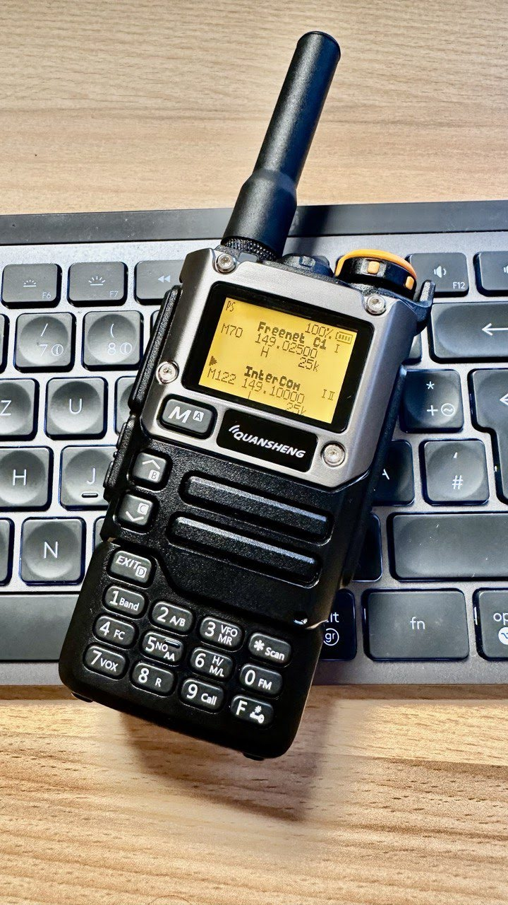

# Open re-implementation of the Quansheng UV-K5 v2.1.27 firmware



This repository is a fork of [Egzumer firmare](https://github.com/egzumer/uv-k5-firmware-custom) plus my changes:

* `ENABLE_SPECTRUM_CHANNEL_SCAN` this enables spectrum channel scan mode (enter by going into memory mode and press F+5, this allows SUPER fast channel scanning (**4.5x faster than regular scanning**), regular scan of 200 memory channels takes roughly 18 seconds, **spectrum memory scan takes roughly 4 seconds**, if you have less channels stored i.e 50 - the spectrum memory scan will take only **1 second**
* **NUNU Protocol** - message hopping mesh network functionality which allows to extend the range of infrastructure-less communications via intermediate stations (nodes), more info at [Mesh network](https://github.com/kamilsss655/uv-k5-firmware-custom/wiki/43-%E2%80%90-Mesh-network)
* `ENABLE_ENCRYPTION` - ChaCha20 256 bit encryption for the messenger, more info at [Encryption](https://github.com/kamilsss655/uv-k5-firmware-custom/wiki/44-%E2%80%90-Encryption#details)
* Fixed AM AGC so **AM demodulation is crystal clear**, no audible clicks, no need for `AM_FIX`.
* `RxOff` menu setting offsets the receive frequency by any specified amount in the range of `0-150Mhz` for use with upconverters. Allows to fine tune frequency (in `1kHz` steps) as opposed to other implementations that use hardcoded offsets. (**IMPORTANT: Make sure you set this value to 0 if not using an upconverter, when used for the first time. Otherwise it might load some random offset from EEPROM.**)
* `ENABLE_SPECTRUM_COPY_VFO` allowing to exit the spectrum and fine tuning screen with PTT button and copy current peak frequency, modulation, step, bandwidth to VFO. Also entering spectrum will carry these settings from VFO (full integration). Now to enter fine tuning screen in spectrum press MENU button. This allows you to save and respond to the frequencies found much faster.
* `ENABLE_SPECTRUM_SHOW_CHANNEL_NAME` shows channel number and channel name of the peak frequency in spectrum
* `ENABLE_ADJUSTABLE_RX_GAIN_SETTINGS` keeps the rx gain settings set in spectrum mode after exit (otherwise these are always overwritten to default value), this makes much more sense considering that we have a radio with user adjustable gain so why not use it to adjust to current radio conditions, maximum gain allows to greatly increase reception in scan memory channels mode (in this configuration default gain settings are only set at boot and when exiting AM modulation mode to set it to sane value after am fix)
* `VOXSen` fixed and improved VOX sensitivity setting from menu. Added `VoxDel` - VOX delay setting allowing to set value to `0` for no VOX delay which might be useful for packet radio enthusiasts (APRS etc.).
* `SqTone` configurable squelch tail tones and 180* phase shift tail when in CTCSS mode

> [!WARNING]  
> Use this firmware at your own risk (entirely). There is absolutely no guarantee that it will work in any way shape or form on your radio(s), it may even brick your radio(s), in which case, you'd need to buy another radio.
Anyway, have fun.

---

## Table of Contents
* [Videos](#videos)
* [Main Features](#main-features)
* [Manual](#manual)
* [Radio Performance](#radio-performance)
* [User Customization](#user-customization)
* [Compiler](#compiler)
* [Building](#building)
* [Credits](#credits)
* [How to contribute](#how-to-contribute)
* [License](#license)

---
## Videos:

Video showing FM reception in spectrum channel mode:

https://github.com/kamilsss655/uv-k5-firmware-custom/assets/8842065/a30c1031-a4c9-4021-8c44-c7532e354d27

Video showing AM reception in spectrum channel mode:

https://github.com/kamilsss655/uv-k5-firmware-custom/assets/8842065/638a9985-b808-4cbf-9b98-628df64dba46

Video showing FM reception in spectrum channel mode:

https://github.com/kamilsss655/uv-k5-firmware-custom/assets/8842065/a106f5cb-8794-4149-9cbb-2f672c0c5b39

Video showing AM reception in VFO mode:

[](https://www.youtube.com/shorts/GOZYdKd8wng)

Video showing SSB reception with a CB antenna mounted on the roof of a car:

https://github.com/kamilsss655/uv-k5-firmware-custom/assets/8842065/d0e931ba-90ca-4644-b48e-4aace1d1842c

Video of the NUNU Protocol enabling message hopping (available in v.21.0):

https://github.com/kamilsss655/uv-k5-firmware-custom/assets/8842065/5392ce36-9308-4a54-a92c-a82474b4b0d5

Video of the NUNU Protocol with 4 radios:

https://github.com/kamilsss655/uv-k5-firmware-custom/assets/8842065/078dca54-b9aa-4930-bf19-0529c1c1791b

## Main features:
* many of OneOfEleven mods:
   * AM fix, huge improvement in reception quality
   * long press buttons functions replicating F+ action
   * fast scanning
   * channel name editing in the menu
   * channel name + frequency display option
   * shortcut for scan-list assignment (long press `5 NOAA`)
   * scan-list toggle (long press `* Scan` while scanning)
   * configurable button function selectable from menu
   * battery percentage/voltage on status bar, selectable from menu
   * longer backlight times
   * mic bar
   * RSSI s-meter
   * more frequency steps
   * squelch more sensitive
* fagci spectrum analyzer (**F+5** to turn on)
* some other mods introduced by egzumer:
   * SSB demodulation (adopted from fagci)
   * backlight dimming
   * battery voltage calibration from menu
   * better battery percentage calculation, selectable for 1600mAh or 2200mAh
   * more configurable button functions
   * long press MENU as another configurable button
   * better DCS/CTCSS scanning in the menu (`* SCAN` while in RX DCS/CTCSS menu item)
   * Piotr022 s-meter style
   * restore initial freq/channel when scanning stopped with EXIT, remember last found transmission with MENU button
   * reordered and renamed menu entries
   * LCD interference crash fix
* joaquimorg messenger

 ## Manual

 Please take a look at the [Wiki](https://github.com/kamilsss655/uv-k5-firmware-custom/wiki) section for instructions, tips and more:

* [Radio operation](https://github.com/kamilsss655/uv-k5-firmware-custom/wiki/10-%E2%80%90-Radio-operation)

* [Menu](https://github.com/kamilsss655/uv-k5-firmware-custom/wiki/20-%E2%80%90-Menu)

* [Button functions](https://github.com/kamilsss655/uv-k5-firmware-custom/wiki/30-%E2%80%90-Button-functions)

* [Spectrum analyzer](https://github.com/kamilsss655/uv-k5-firmware-custom/wiki/40-%E2%80%90-Spectrum-analyzer)

* [Messenger](https://github.com/kamilsss655/uv-k5-firmware-custom/wiki/42--%E2%80%90-Messenger)

* [Mesh network](https://github.com/kamilsss655/uv-k5-firmware-custom/wiki/43-%E2%80%90-Mesh-network)

* [Encryption](https://github.com/kamilsss655/uv-k5-firmware-custom/wiki/44-%E2%80%90-Encryption)

* [FM broadcast radio receiver](https://github.com/kamilsss655/uv-k5-firmware-custom/wiki/50-%E2%80%90--FM-broadcast-radio-receiver)

* [Flashing the firmware](https://github.com/kamilsss655/uv-k5-firmware-custom/wiki/60-%E2%80%90-Flashing-the-firmware)

* [Differences from egzumer firmware](https://github.com/kamilsss655/uv-k5-firmware-custom/wiki/70-%E2%80%90-Differences-from-egzumer-firmware)

* [Tips & Tricks and Known Issues](https://github.com/kamilsss655/uv-k5-firmware-custom/wiki/80-%E2%80%90-Tips-&-Tricks-and-Known-Issues)


## Radio performance

Please note that the Quansheng UV-Kx radios are not professional quality transceivers, their
performance is strictly limited. The RX front end has no track-tuned band pass filtering
at all, and so are wide band/wide open to any and all signals over a large frequency range.

Using the radio in high intensity RF environments will most likely make reception anything but
easy (AM mode will suffer far more than FM ever will), the receiver simply doesn't have a
great dynamic range, which results in distorted AM audio with stronger RX'ed signals.
There is nothing more anyone can do in firmware/software to improve that, once the RX gain
adjustment I do (AM fix) reaches the hardwares limit, your AM RX audio will be all but
non-existent (just like Quansheng's firmware).
On the other hand, FM RX audio will/should be fine.

But, they are nice toys for the price, fun to play with.

## User customization

You can customize the firmware by enabling/disabling various compile options, this allows
us to remove certain firmware features in order to make room in the flash for others.
You'll find the options at the top of "Makefile" ('0' = disable, '1' = enable) ..

```
ENABLE_CLANG                       := 0     **experimental, builds with clang instead of gcc (LTO will be disabled if you enable this)
ENABLE_SWD                         := 0       only needed if using CPU's SWD port (debugging/programming)
ENABLE_OVERLAY                     := 0       cpu FLASH stuff, not needed
ENABLE_LTO                         := 1     **experimental, reduces size of compiled firmware but might break EEPROM reads (OVERLAY will be disabled if you enable this)

ENABLE_UART                        := 1       without this you can't configure radio via PC !
ENABLE_AIRCOPY                     := 0       easier to just enter frequency with butts
ENABLE_FMRADIO                     := 1       WBFM VHF broadcast band receiver
ENABLE_NOAA                        := 0       everything NOAA (only of any use in the USA)
ENABLE_VOICE                       := 0       want to hear voices ?
ENABLE_VOX                         := 1
ENABLE_ALARM                       := 0       TX alarms
ENABLE_TX1750                      := 0       side key 1750Hz TX tone (older style repeater access)
ENABLE_PWRON_PASSWORD              := 0       power-on password stuff
ENABLE_DTMF_CALLING                := 0       DTMF calling fuctionality, sending calls, receiving calls, group calls, contacts list etc.

ENABLE_BIG_FREQ                    := 1       big font frequencies (like original QS firmware)
ENABLE_SMALL_BOLD                  := 1       bold channel name/no. (when name + freq channel display mode)
ENABLE_KEEP_MEM_NAME               := 1       maintain channel name when (re)saving memory channel
ENABLE_WIDE_RX                     := 1       full 18MHz to 1300MHz RX (though front-end/PA not designed for full range)
ENABLE_TX_WHEN_AM                  := 0       allow TX (always FM) when RX is set to AM
ENABLE_F_CAL_MENU                  := 0       enable the radios hidden frequency calibration menu
ENABLE_SHOW_CHARGE_LEVEL           := 0       show the charge level when the radio is on charge
ENABLE_REVERSE_BAT_SYMBOL          := 0       mirror the battery symbol on the status bar (+ pole on the right)
ENABLE_NO_CODE_SCAN_TIMEOUT        := 1       disable 32-sec CTCSS/DCS scan timeout (press exit butt instead of time-out to end scan)
ENABLE_SQUELCH_MORE_SENSITIVE      := 0       make squelch levels a little bit more sensitive - this has been reported to cause radio freeze in presence of strong signals
ENABLE_FASTER_CHANNEL_SCAN         := 1       increases the channel scan speed, but the squelch is also made more twitchy
ENABLE_RSSI_BAR                    := 1       enable a dBm/Sn RSSI bar graph level in place of the little antenna symbols
ENABLE_AUDIO_BAR                   := 1       experimental, display an audio bar level when TX'ing
ENABLE_COPY_CHAN_TO_VFO            := 1       copy current channel into the other VFO. Long press `1 BAND` when in channel mode
ENABLE_SPECTRUM                    := 1       fagci spectrum analyzer, activated with `F` + `5 NOAA`
ENABLE_REDUCE_LOW_POWER            := 1       makes low power settings even lower (L=0.45W M=3W H=4.7W (f=147Mhz))
ENABLE_BYP_RAW_DEMODULATORS        := 0       additional BYP (bypass?) and RAW demodulation options, proved not to be very useful, but it is there if you want to experiment
ENABLE_BLMIN_TMP_OFF               := 0       additional function for configurable buttons that toggles `BLMin` on and off wihout saving it to the EEPROM
ENABLE_SCAN_RANGES                 := 1       scan range mode for frequency scanning, see wiki for instructions (radio operation -> frequency scanning)
ENABLE_SPECTRUM_COPY_VFO           := 1       pressing MENU in spectrum mode will exit and copy current peak frequency, bw, step, modulation to current VFO, also entering spectrum will carry these settings from VFO (full integration)
ENABLE_SPECTRUM_SHOW_CHANNEL_NAME  := 1       shows channel number and channel name of the peak frequency in spectrum
ENABLE_ADJUSTABLE_RX_GAIN_SETTINGS := 1       keeps the rx gain settings set in spectrum mode after exit (otherwise these are always overwritten to default value), this makes much more sense considering that we have a radio with user adjustable gain so why not use it to adjust to current radio conditions, maximum gain allows to greatly increase reception in scan memory channels mode (in this configuration default gain settings are only set at boot and when exiting AM modulation mode to set it to sane value after am fix)
ENABLE_SPECTRUM_CHANNEL_SCAN       := 1       this enables spectrum channel scan mode (enter by going into memory mode and press F+5, this allows SUPER fast channel scanning (4.5x faster than regular scanning), regular scan of 200 memory channels takes roughly 18 seconds, spectrum memory scan takes roughly 4 seconds, if you have less channels stored i.e 50 - the spectrum memory scan will take only **1 second**
ENABLE_MESSENGER                   := 1       enable messenger
ENABLE_MESSENGER_FSK_MUTE          := 1       mutes speaker once it detects fsk sync word (might cause unintentional mutes during ctcss rx)
ENABLE_MESSENGER_NOTIFICATION      := 1       enable messenger delivery notification
ENABLE_MESSENGER_UART              := 0       enable sending messages via serial with SMS:content command (unreliable)
ENABLE_ENCRYPTION                  := 1       enable ChaCha20 256 bit encryption for messenger
```


## Compiler

arm-none-eabi GCC version 10.3.1 is recommended, which is the current version on Ubuntu 22.04.03 LTS.
Other versions may generate a flash file that is too big.
You can get an appropriate version from: https://developer.arm.com/downloads/-/gnu-rm

clang may be used but isn't fully supported. Resulting binaries may also be bigger.
You can get it from: https://releases.llvm.org/download.html

## Building

If you have docker installed you can use [compile-with-docker.bat](./compile-with-docker.bat) (Windows) or [compile-with-docker.sh](./compile-with-docker.sh) (Linux/Mac), the output files are created in `compiled-firmware` folder. This method gives significantly smaller binaries, I've seen differences up to 1kb, so it can fit more functionalities this way. The challenge can be (or not) installing docker itself.


1. To compile:
```
make docker
```
2. To compile and flash:
```
make run
```

## Credits

Many thanks to various people on Telegram for putting up with me during this effort and helping:

* [OneOfEleven](https://github.com/OneOfEleven)
* [DualTachyon](https://github.com/DualTachyon)
* [Egzumer](https://github.com/egzumer)
* [Joaquimorg](https://github.com/joaquimorg)
* [Mikhail](https://github.com/fagci)
* [Andrej](https://github.com/Tunas1337)
* [Manuel](https://github.com/manujedi)
* @wagner
* @Lohtse Shar
* @Davide
* @Ismo OH2FTG
* @d1ced95
* [@Matoz](https://github.com/spm81)
* and others I forget

<a href="https://github.com/kamilsss655/uv-k5-firmware-custom/graphs/contributors">
  
</a>

## How to contribute

Thank you for your interest in contributing to this project! Here are some of the many ways in which you can help:

* Report bugs
* Suggest improvements
* Audit the source code
* Submit PRs to fix bugs or implement features
* Test new releases and updates
* Record videos and post on other platforms
* Spread the word about this project
* Write and edit the documentation
* Donate to the project using the "Sponsor" button
   
## License

Original work Copyright 2023 Dual Tachyon
https://github.com/DualTachyon

Modified work Copyright 2024 kamilsss655
https://github.com/kamilsss655

Licensed under the Apache License, Version 2.0 (the "License");
you may not use this file except in compliance with the License.
You may obtain a copy of the License at

    http://www.apache.org/licenses/LICENSE-2.0

    Unless required by applicable law or agreed to in writing, software
    distributed under the License is distributed on an "AS IS" BASIS,
    WITHOUT WARRANTIES OR CONDITIONS OF ANY KIND, either express or implied.
    See the License for the specific language governing permissions and
    limitations under the License.
